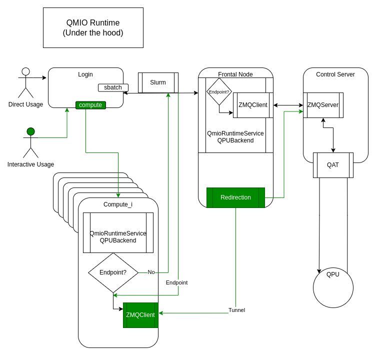

# Qmio
Python module to interact with the different backends available in the Qmio system at CESGA.




## Installation

> **Warning!**
> The pipy versión is outdated since versión 0.1.3.

```bash
pip install qmio
```


## Usage
```python
from qmio import QmioRuntimeService

circuit = 'OPENQASM 3.0;\ninclude "qelib1.inc";\nqreg q[32];\ncreg c[32];\nx q[0];\nmeasure q[0]->c[0];'

service = QmioRuntimeService()
with service.backend(name='qpu') as backend:
    result = backend.run(circuit=circuit, shots=1000)

print(result)
```


## Develop

If you want to develop it is helpful to have access to a ZMQ_SERVER with dummy quantum hardware attached to it. We have deployed a virtual machine named v-lx7 that does exactly that. It is deployed using CESGA's infrastructure under 10.133.29.226 IP. You can simply use the ZMQ server as normal under this IP:PORT.

Simply export an env variable to use it from CESGA's Network against this virtual ZMQServer.
```bash
export ZMQ_SERVER="tcp://10.133.29.226:5556"
```

## Versioning
The package version is picked up dinamicaly from ```qmio/__init__.py __version__: str``` variable into pyproject.toml. This will be taken into account for packae building. 

With hatch you can manage this using ```hatch version``` commands.

To show the version
```bash
hatch version
```


To push the version from 0.1.0 to 0.1.1
```bash
hatch version patch 
```

To push the version from 0.1.1 to 0.2.0
```bash
hatch version minor
```

To push the version from 0.2.0 to 1.0.0
```bash
hatch version major
```

For more info visit [https://hatch.pypa.io/latest/version/]("hatch versioning").

## Virtual envs

To see already managed virtual envs use:
```bash
hatch env show 
```

To get a shell under ENV_NAME virtual env use:
```bash
hatch shell <ENV_NAME>
```

If environment scripts are defined, use the following command to run it.
```bash
hatch run <ENV_NAME>:<SCRIPT_NAME>
```

Define its dependencies under pyproject.toml tool.hatch.envs header. As an example:
```toml
[tool.hatch.envs.docs]
dependencies = [
  "sphinx",
]
```

You can also activate them manually by sourcing the following path.
```bash
source $HOME/.local/share/hatch/env/virtual/<PROJECT_NAME>/ID/<VIRTUAL_ENV>/bin/activate
```


## Build

If you use hatch:
This command will output the .whl and the .tar.gz into dist/ at top level.
```bash
hatch build
```

If you want to clean the build use:
```bash
hatch clean
```

### Virtual ZMQServer
If you want to change something in the VM or redeploy the server, connect through ssh. First you'll need to have access so talk to the manteiners.
```bash
ssh cesgaxuser@10.133.29.226
```

Once there you can look for the logs of the ZMQ server in the 
```bash
~/receiver.log
```

Stop the server killing the process:
get the RECEIVER_PID
```bash
ps aux | grep receiver |grep -v grep | awk '{print $2}'
```

kill the process
```bash
kill -9 RECEIVER_PID
```

Start the receiver again
```bash
/home/cesgaxuser/start.sh
```

Receiver is in sync with qat-rpc package. [https://github.com/oqc-community/qat-rpc](oqc-compunity/qat-rpc)


## Tests

There are some hatch commands to perform the tests. 
Run all the tests in /tests (It accepts arguments). 
```bash
hatch test {Optional Args: tests/test_utils.py}
```

With coverage report. It also accepts arguments.
```bash
hatch test --cover
```

Full test in the defined matrix under pyproject.toml header.
```toml
[[tool.hatch.envs.hatch-test.matrix]]
python = ["3.11", "3.9"]
```

```bash
hatch test --cover --all
```

If you are not using hatch check the commands under the pyproject.toml header.
```toml
[tool.hatch.envs.hatch-test.scripts]
```


## Docs

There is a hatch env to build the docs. 

with hatch:
This will generate the .html files in ```docs/build```.
```bash
hatch run docs:pre-build
hatch run docs:build-docs
```


If you are not using hatch, read into pyproject.toml the docs section under the following header.
```toml
[tools.hatch.envs.docs]
```


## Extra refernces

- [https://github.com/gomeztato/qmiotools](qmio-tools)
- [https://github.com/oqc-community/qat-rpc](qat-rpc)
- [https://github.com/oqc-community/qat](qat)

- [https://hatch.pypa.io/latest/](hatch)
